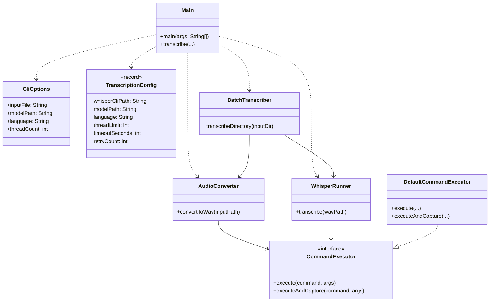

# UML Diagram

```mermaid
classDiagram
    class Main {
        +main(args: String[])
        +transcribe(...)
    }
    class CliOptions {
        +inputFile: String
        +modelPath: String
        +language: String
        +threadCount: int
    }
    class TranscriptionConfig {
        <<record>>
        +whisperCliPath: String
        +modelPath: String
        +language: String
        +threadLimit: int
        +timeoutSeconds: int
        +retryCount: int
    }
    class CommandExecutor {
        <<interface>>
        +execute(command, args)
        +executeAndCapture(command, args)
    }
    class DefaultCommandExecutor {
        +execute(...)
        +executeAndCapture(...)
    }
    class AudioConverter {
        +convertToWav(inputPath)
    }
    class WhisperRunner {
        +transcribe(wavPath)
    }
    class BatchTranscriber {
        +transcribeDirectory(inputDir)
    }

    Main ..> CliOptions
    Main ..> TranscriptionConfig
    Main ..> AudioConverter
    Main ..> WhisperRunner
    Main ..> BatchTranscriber
    AudioConverter --> CommandExecutor
    WhisperRunner --> CommandExecutor
    DefaultCommandExecutor ..|> CommandExecutor
    BatchTranscriber --> AudioConverter
    BatchTranscriber --> WhisperRunner
```
